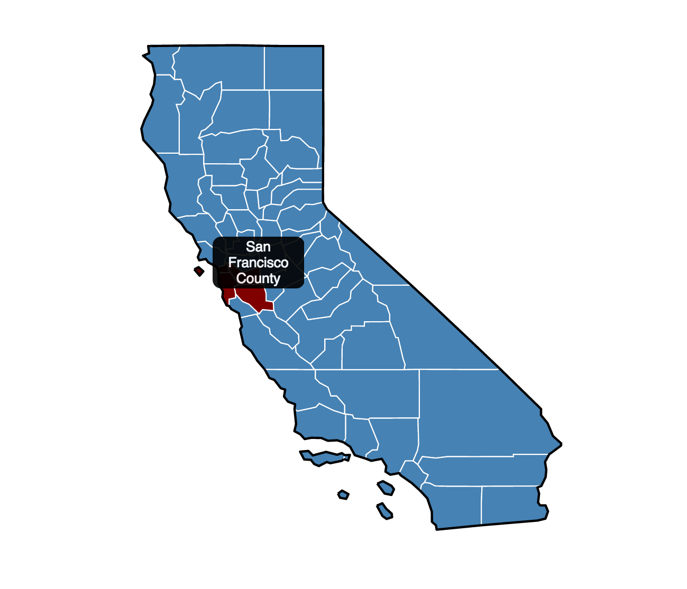

##California Counties in TopoJSON
Open sourcing this mostly because I couldn't find a good simple TopoJSON file of California counties suitable for mapping with D3.

`ca-counties-topo-simple.json` is your best bet.  `ca-counties-topo.json` is the same info before Mapshaper simplification.

Here's how the map looks with a Mercator projection and some styling and a tooltip. [Live version here](http://scottpham.github.io/california-counties/).

##How It's Made
I made this using Census TIGER files and converted to geoJSON with ogr2ogr. Then converted to TopoJSON with Mike Bostock's topojson command line tool.

Also included in the topojson is some random stuff that the census file included which I decided to leave in.  `areaLand` and `areaWater` properties should give the respective land and water areas in square meters (if I'm reading [this](http://quickfacts.census.gov/qfd/meta/long_LND110210.htm) correctly). 

Comes out to just a few KB after [Mapshaping](http://www.mapshaper.org/) so the extra data doesn't hurt!
##Projection
I found a nice ["projected" TopoJSON]() from Bostock's examples, which means you can set the projection to `null`. 

But I wanted to get a pure TopoJSON for future-proofing purposes.  I couldn't actually figure out the Albers projection without using AlbersUSA and transforming to find California (seemed like a copout!) so I just used Mercator:

    var svg = d3.select("#map").append("svg")
	    .attr("width", width)
	    .attr("height", height);
